# 58同城海淀区整租房价格分析

------

```python
pip install -r requirements.txt
```


## 1.数据抓取

​	运行**58Crawler.py**。

- geturllist()为获取58同城上海淀区整租房，1到70页上所有整租房的链接的函数。获取的链接存储为links.json。
- 对于一个整租房，抓取的信息有“租赁方式", "户型", "面积", "装修", "朝向", "高低", "楼层","小区名","区域","次级区域","详细地址","详情","亮点","描述","URL","价格","周期","押金"。

58房产网站具有反爬虫机制，直接用爬虫爬取的房屋户型、房屋面积、房屋租金这三关键信息都是乱码。该手段的原理为使用特殊的自定义字体，它可以把乱码显示成正常的数字。

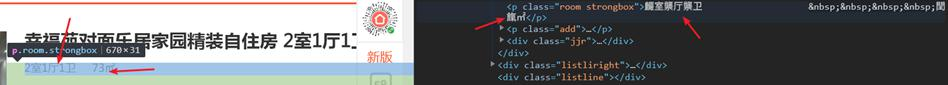

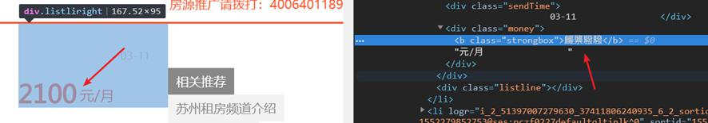

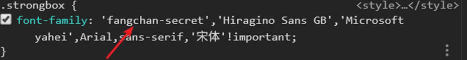

​	解决乱码的方法请参见**decode58.py**。

​	抓取完成后得到**58.csv**。

## 2.初步统计分析

​	运行**Analyse.py**。

- printprice()，打印海淀区整租房的最高价、最低价、平均价、中位数。

- CiJiQuYu_price()，考察海淀区不同子行政区域对平均房价的影响。

  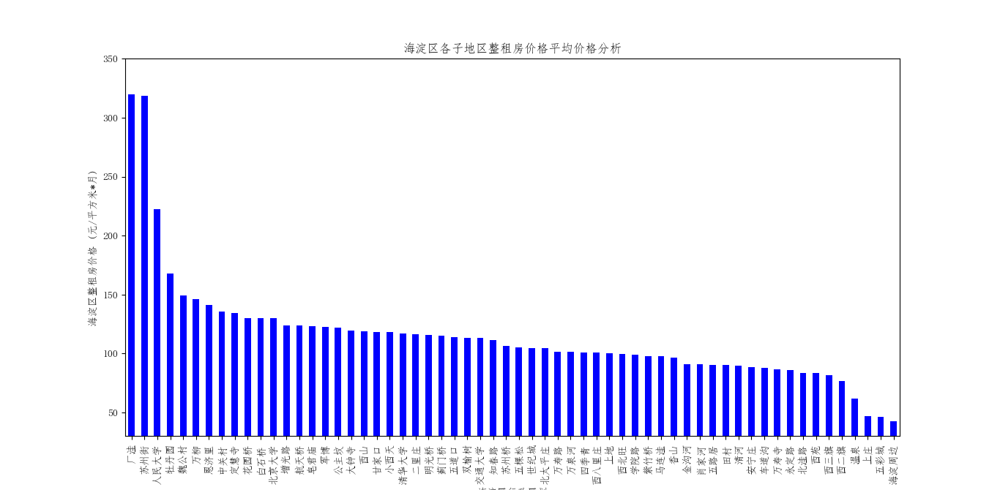

- Mianji_price()，考察不同面积的整租房价格分布。

  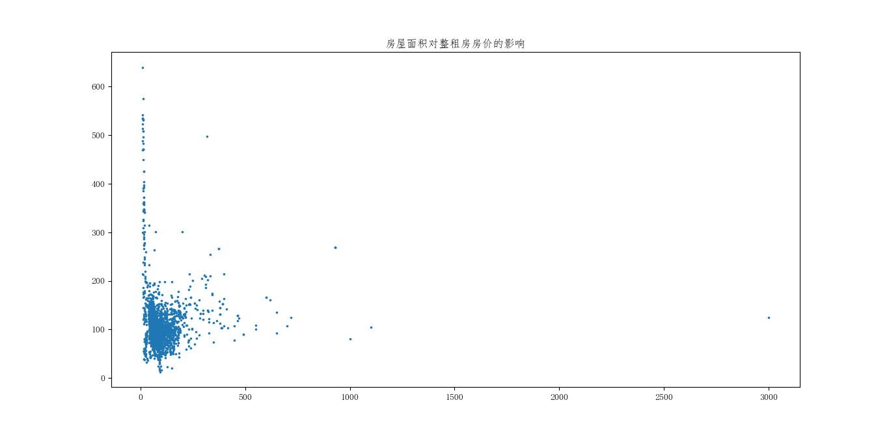

- Huxing_price()，考察整租房户型对价格的影响。

  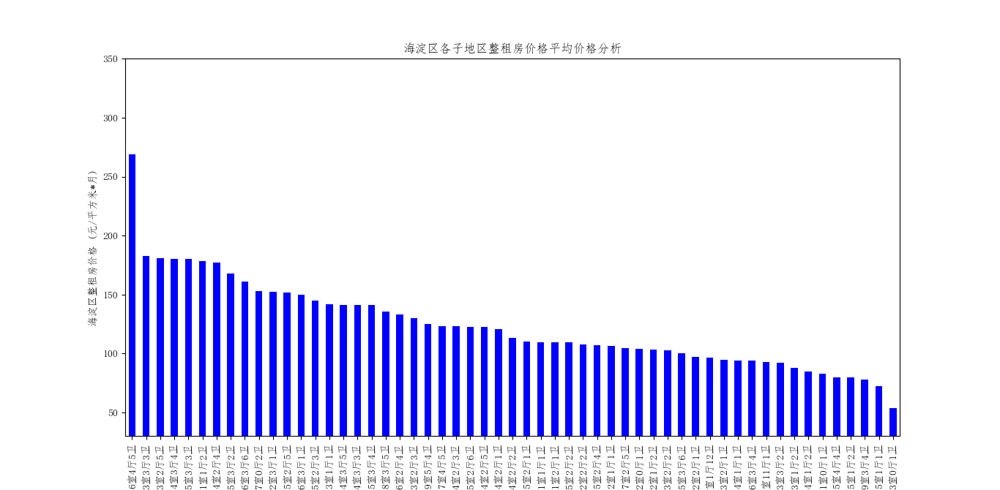

- ZhuangXiu_price()，考察装修情况对整租房价格的影响。

  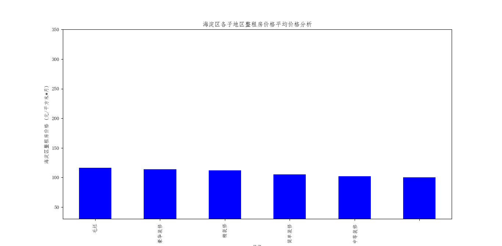

- ChaoXiang_price()，考察房屋朝向对价格的影响。

  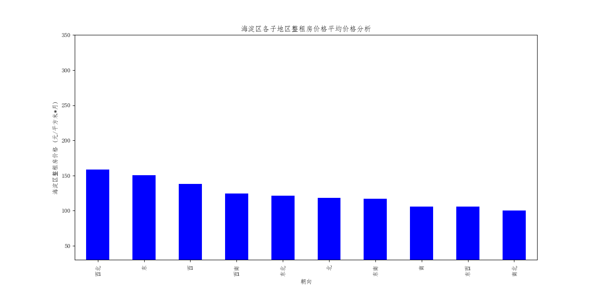

- LouCeng_price()，考察房屋楼层对价格的影响。

  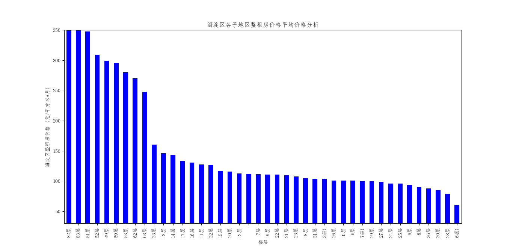

- PayWay_price()，考察押金与支付周期对整租房价格的影响。

  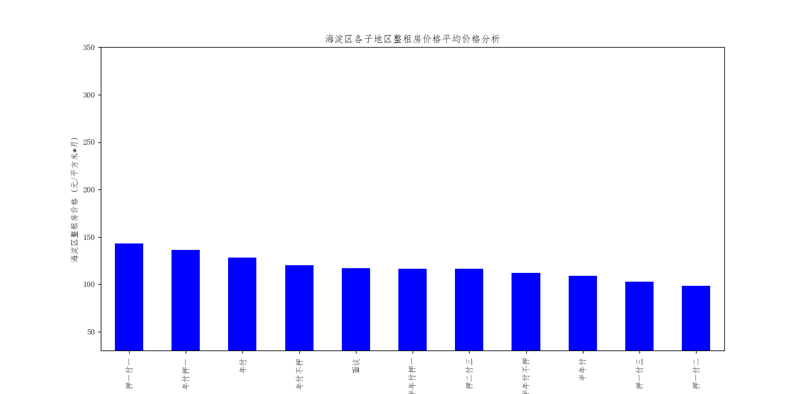

这一步决定了下一步以什么因素对海淀区整租房的价格进行预测，即决定了机器学习需要接收哪些参数输入。

## 3.用sklearn对海淀区整租房的价格进行预测

​	运行**Regression_LR_RFR.py**。使用sklearn集成的的**RandomForestRegressor**模型和**LinearRegression**模型进行预测。使用的参数有整租房面积、户型（户型参数细分为X室Y厅Z卫三个参数）、装修情况、房屋朝向、所在楼层、所在海淀区的子行政区域、押金与支付周期。

​	结果如下：

- LinearRegression模型：mean_squared_error值为： 42899361.78148181，r2_score为： 0.7745312465267574。

  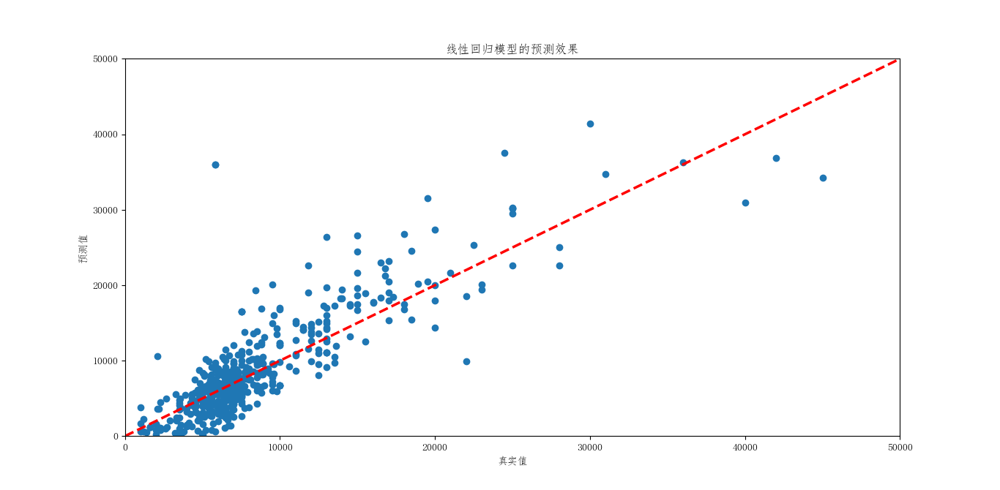

- RandomForestRegressor模型：mean_squared_error值为： 9471322.402774928，r2_score为： 0.95022100173。

  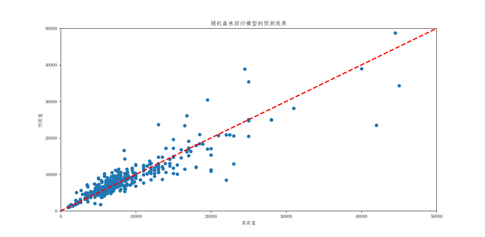

